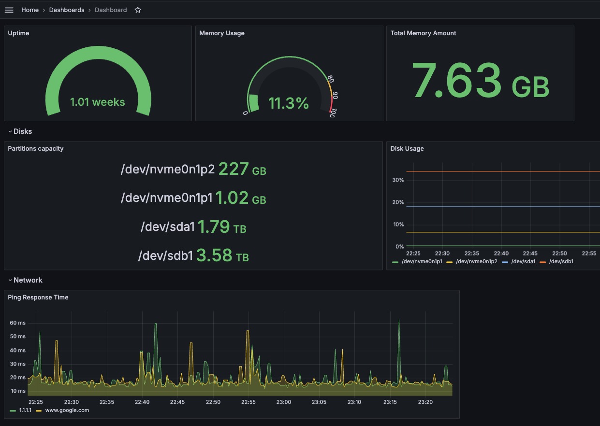

 
 


[](https://github.com/przemekgorzynski/CustomMetricsMonitoring/actions/workflows/unit_tests.yml)
[](https://github.com/przemekgorzynski/CustomMetricsMonitoring/actions/workflows/yamllint.yml)

# CustomMetricsMonitoring

Before running update argunemts (PING_TARGETS, DISK_TYPES_TO_MONITOR) in `docker-compose.yml` file.

```
metrics_exporter:
  container_name: metrics_exporter
  image: metrics_exporter
  build: 
    dockerfile: Dockerfile
    args:
      - PING_TARGETS=1.1.1.1,8.8.8.8,www.google.com
      - DISK_TYPES_TO_MONITOR=sd,nvme,mmc
  ports:
    - 8000:8000
```

Available metrics so far:
- `ping_response_time` - ping response time to remote targets  
- `node_disk_total_space` - total size of disk device
- `node_disk_usage_space` - used size of disk device

## Execution
```
docker-compose up -d --build
```

# Endpoints

## Metrics Exporter
Python service to expose custom metrics to be consumed by Prometheus.

http://localhost:8000

## Prometheus
http://localhost:9090


## Grafana
Default credentials are `admin:admin`

http://localhost:3000


