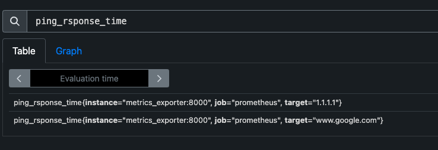

# CustomPrometheusMetrics

Before running update ping targets (PING_TARGETS arg) in `docker-compose.yml` file.

```
metrics_exporter:
  container_name: metrics_exporter
  image: metrics_exporter
  build: 
    dockerfile: Dockerfile
    args:
      - PING_TARGETS=1.1.1.1,8.8.8.8,www.google.com
  ports:
    - 8000:8000
```

Available metrics so far:
- `ping_response_time` - ping response time to remote targets  

## Execution
`docker-compose up -d`

# Endpoints

## Metrics Exporter
Python service to expose custom metrics to be consumed by Prometheus.

http://localhost:8000

## Prometheus
http://localhost:9090




## Grafana
Default credentials are `admin:admin`

http://localhost:3000


